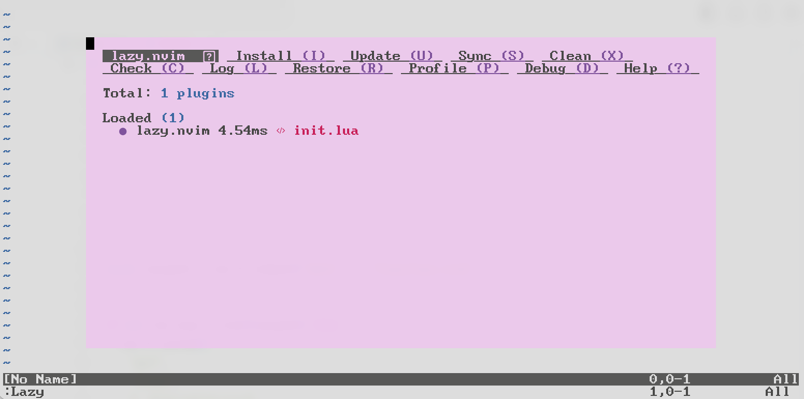

# Use Neovim Plugins with Lazy.nvim

## Introduction

After installing neovim for your machine and including it in
your `PATH`. The next thing is to add the first piece to
the `~/.config/nvim/init.lua` main entrypoint file for neovim.
In this document we'll configure neovim to
automatically install the [lazy plugin manager][lazy-gh].
This is currently *(2023)* the most maintained neovim plugin manager.

## Configuration Structure

First things first,
if the file wasn't created already,
the entrypoint for neovim is in the config root,
usually `~/.config/nvim` as filename `init.lua`.

All configurations and functions from now on
will reside in the config root subdirectory `lua`,
like this path `~/.config/nvim/lua`.
This way the `init.lua` file only has the role of
loading configurations in a certain order and
the first one it's going to load is `lazy-config.lua`.
Create that file and the neovim configuration folder should
look like the `tree` command output below.

```sh
tree ~/.config/nvim
.
├── init.lua
└── lua
    └── lazy-config.lua
```

## Require Lazy-Managed Configs

Before working on configuring and ensuring lazy is installed,
modify the `init.lua` file to load the `lazy-config.lua` file like in
the tree shown above.
Below is the simple single line addition you need to make.

```lua
-- init.lua
require "lazy-config"
```

Every time we create a new configuration file in the `lua` folder,
`require` is the keyword to tell neovim to load it.
The `lua` folder is the root path where all `require` calls will search for
the module in question, in this case the `lazy-config.lua` file.

## Setting Up Lazy

The `lazy-config.lua` file is where we'll configure lazy to install itself and
to configure how it works and
eventually what plugins we want to install.

Now for the first real programmatic configuration.
This block of code is going to get called as soon as `lazy-config.lua` is loaded.
It's going to define the path where lazy will be installed and
then it's going to install lazy if it's not already installed.

```lua
-- lua/lazy-config.lua

-- Setup the path where lazy will store plugins and where manager itself lives
local lazypath = vim.fn.stdpath("data") .. "/lazy/lazy.nvim"

-- Check if lazy already exists, if not use git to clone the latest stable vers
if not vim.loop.fs_stat(lazypath) then
  vim.fn.system({
    "git",
    "clone",
    "--filter=blob:none",
    "https://github.com/folke/lazy.nvim.git",
    "--branch=stable", -- latest stable release
    lazypath,
  })
end
vim.opt.rtp:prepend(lazypath)

-- Now we add this line to tell lazy.nvim what file defines the plugins
require("lazy").setup('plugins')
```

This block of code in Lua will do the following:

* Setup a known path called `lazypath` where...
  * Lazy plugin manager gets installed to.
  * Plugins get installed to.
* Check if there's anything in `lazypath` and if not...
  * Use git to clone the latest stable version of lazy.

The last part of the code is to tell lazy where to find the plugin definitions.
We'll get to this next but essentially it tells lazy to look for a file called
`plugins.lua` in the `lua` folder to start the plugin manager with neovim.

### Define Plugins

Now for the next file in the `lua` folder, `plugins.lua`.
You can create the file with the `touch ~/.local/nvim/lua/plugins.lua` command.
And a tree command will show the current state of the config folder.

```sh
touch ~/.config/nvim/lua/plugins.lua
tree ~/.config/nvim
.
├── init.lua
└── lua
    ├── lazy-config.lua
    └── plugins.lua
```

Now the code to add is a simple `return` statement that
when this module is called,
like in the `lazy-config.lua` file's `require("lazy").setup('plugins')` line,
the `plugins.lua` module will return a table of plugins and their configuratios
to install.

```lua
-- lua/plugins.lua
return {
    -- Plugin entries go here
}
```

We'll be coming back to here a lot in the future,
this returned table will have plugin references and configurations added.
The plugin references are usually a GitHub `repo_owner/repo_name` string.
Then next to it you can define variables that
the plugins will expect and then use to configure themselves.

### First Load of Lazy

With that out of the way we're ready to load lazy for the first time.
Quit neovim if it's running and
then start it again with the `nvim` command.

> **Note:** Although it's a bit of a meme at this point,
> quitting neovim or vim is done by pressing the `ESC` key and
> then typing `:q` and pressing `ENTER`.
> Just to be sure you can actually operate neovim.

When re-entering neovim,
use the neovim command prompt by using the `:` colon character and
then type `Lazy` to open up the lazy plugin manager.
It should look something like this with only one plugin loaded,
that is the lazy plugin manager itself.



More plugins will be added later.

## Note on Lazy Lockfile

The Lazy plugin manager will create a lockfile in the `lazypath` directory.
This is an important file to keep in your git repository.
It helps form consistent reproducible builds of your neovim configuration.

## References

* [GitHub: folke/lazy.nvim][lazy-gh]

<!-- Hidden References -->
[lazy-gh]: https://github.com/folke/lazy.nvim "GitHub: folke/lazy.nvim"
